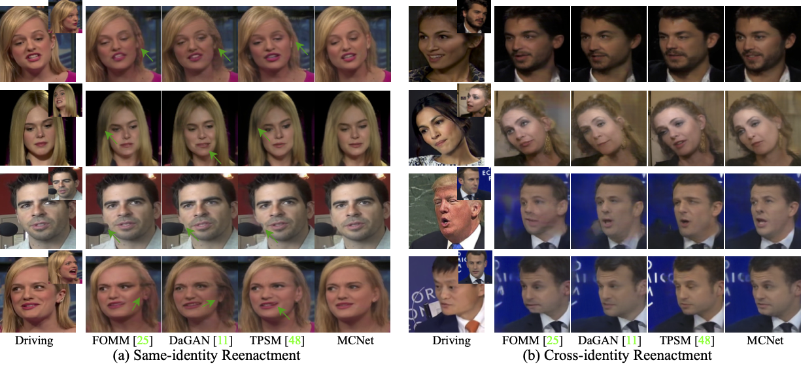

## :book: Implicit Identity Representation Conditioned Memory Compensation Network for Talking Head Video Generation (ICCV 2023)
<p align="center">
  <small>:fire: If MCNet is helpful in your photos/projects, please help to :star: it or recommend it to your friends. Thanks:fire:</small>
</p>


> [[Paper](https://arxiv.org/abs/2307.09906) &emsp; [[Project Page](https://harlanhong.github.io/publications/mcnet.html)]  &emsp; [[Poster Video](https://www.youtube.com/watch?v=nahsJNjWzGo&t=1s)]<br>
<!-- > [Fa-Ting Hong](https://harlanhong.github.io), [Longhao Zhang](https://dblp.org/pid/236/7382.html), [Li Shen](https://scholar.google.co.uk/citations?user=ABbCaxsAAAAJ&hl=en), [Dan Xu](https://www.danxurgb.net) <br> -->
<!-- > The Hong Kong University of Science and Technology, Alibaba Cloud -->
> [Fa-Ting Hong](https://harlanhong.github.io), [Dan Xu](https://www.danxurgb.net) <br>
> The Hong Kong University of Science and Technology<br>


<p align="center">
  
</p>


:triangular_flag_on_post: **Updates** 
- :fire::fire::white_check_mark: July 20 2023: Our new talking head work **[MCNet](https://harlanhong.github.io/publications/mcnet.html)** was accpted by ICCV2023. The code will be released in ten days. You can talk a look at our previous work **[DaGAN](https://harlanhong.github.io/publications/dagan.html)** first.


## :wrench: Dependencies and Installation

- Python >= 3.7 (Recommend to use [Anaconda](https://www.anaconda.com/download/#linux) or [Miniconda](https://docs.conda.io/en/latest/miniconda.html))
- [PyTorch >= 1.7](https://pytorch.org/)
- Option: NVIDIA GPU + [CUDA](https://developer.nvidia.com/cuda-downloads)
- Option: Linux

### Installation
We now provide a *clean* version of MCNet, which does not require customized CUDA extensions. <br>

1. Clone repo

    ```bash
    git clone https://github.com/harlanhong/ICCV2023-MCNET.git
    cd ICCV2023-MCNET
    ```

2. Install dependent packages

    ```bash
    pip install -r requirements.txt

    ## Install the Face Alignment lib
    cd face-alignment
    pip install -r requirements.txt
    python setup.py install
    ```
## :zap: Quick Inference

We take the paper version for an example. More models can be found [here](https://hkustconnect-my.sharepoint.com/:f:/g/personal/fhongac_connect_ust_hk/EjfeXuzwo3JMn7s0oOPN_q0B81P5Wgu_kbYJAh7uSAKS2w?e=KaQcPk).

### YAML configs
See ```config/vox-256.yaml``` to get description of each parameter.

### Pre-trained checkpoint
The pre-trained checkpoint of face depth network and our MCNet checkpoints can be found under following link: [OneDrive](https://hkustconnect-my.sharepoint.com/:f:/g/personal/fhongac_connect_ust_hk/Eow4kyCdz_9Ctw-Xj8cA0KwBVyh7ohx-x4-0UhgWiaSpkg?e=TOlwpa).

**Inference!**
To run a demo, download checkpoint and run the following command:

```bash
CUDA_VISIBLE_DEVICES=0 python demo.py  --config config/vox-256.yaml --driving_video path/to/driving --source_image path/to/source --checkpoint path/to/checkpoint --relative --adapt_scale --kp_num 15 --generator Unet_Generator_keypoint_aware --result_video path/to/result --mbunit ExpendMemoryUnit --memsize 1 
```
<!-- python demo.py  --config config/vox-256.yaml --driving_video /data/fhongac/origDataset/vox1/train/id10686#zDkgVesX7NU#001423#001797.mp4 --checkpoint checkpoints/00000099-checkpoint.pth.tar --relative --adapt_scale --kp_num 15 --generator Unet_Generator_keypoint_aware --result_video synthetic_2.mp4  --source_image /data/fhongac/origDataset/vox1_frames/train/id10686#zDkgVesX7NU#001423#001797.mp4/0000000.png --mbunit ExpendMemoryUnit --memsize 1  -->

The result will be stored in ```path/to/result```. The driving videos and source images should be cropped before it can be used in our method. To obtain some semi-automatic crop suggestions you can use ```python crop-video.py --inp some_youtube_video.mp4```. It will generate commands for crops using ffmpeg. 


## :computer: Training


### Datasets
 
1) **VoxCeleb**. Please follow the instruction from https://github.com/AliaksandrSiarohin/video-preprocessing.

### Train on VoxCeleb
To train a model on specific dataset run:
```
CUDA_VISIBLE_DEVICES=0 python -m torch.distributed.launch --master_addr="0.0.0.0" --master_port=12347 run.py --config config/vox-256.yaml --name MCNet --batchsize 8 --kp_num 15 --generator Unet_Generator_keypoint_aware --GFM GeneratorFullModel --memsize 1 --kp_distance 10 --feat_consistent 10 --generator_gan 0 --mbunit ExpendMemoryUnit
```

The code will create a folder in the log directory (each run will create a new name-specific directory).
Checkpoints will be saved to this folder.
To check the loss values during training see ```log.txt```.
By default the batch size is tunned to run on 8 GeForce RTX 3090 gpu (You can obtain the best performance after about 150 epochs). You can change the batch size in the train_params in ```.yaml``` file.


Also, you can watch the training loss by running the following command:
```bash
tensorboard --logdir log/MCNet/log
```
When you kill your process for some reasons in the middle of training, a zombie process may occur, you can kill it using our provided tool:
 ```bash
python kill_port.py PORT
```

### Training on your own dataset
1) Resize all the videos to the same size e.g 256x256, the videos can be in '.gif', '.mp4' or folder with images.
We recommend the later, for each video make a separate folder with all the frames in '.png' format. This format is loss-less, and it has better i/o performance.

2) Create a folder ```data/dataset_name``` with 2 subfolders ```train``` and ```test```, put training videos in the ```train``` and testing in the ```test```.

3) Create a config ```config/dataset_name.yaml```, in dataset_params specify the root dir the ```root_dir:  data/dataset_name```. Also adjust the number of epoch in train_params.


## :scroll: Acknowledgement

 Our MCNet implementation is inspired by [FOMM](https://github.com/AliaksandrSiarohin/first-order-model). We appreciate the authors of [FOMM](https://github.com/AliaksandrSiarohin/first-order-model) for making their codes available to public.

## :scroll: BibTeX

```
@inproceedings{hong23implicit,
            title={Implicit Identity Representation Conditioned Memory Compensation Network for Talking Head video Generation},
            author={Hong, Fa-Ting and Xu, Dan},
            booktitle={ICCV},
            year={2023}
          }

@inproceedings{hong2022depth,
            title={Depth-Aware Generative Adversarial Network for Talking Head Video Generation},
            author={Hong, Fa-Ting and Zhang, Longhao and Shen, Li and Xu, Dan},
            journal={IEEE/CVF Conference on Computer Vision and Pattern Recognition (CVPR)},
            year={2022}
          }

@inproceedings{hong2023depth,
            title={DaGAN++: Depth-Aware Generative Adversarial Network for Talking Head Video Generation},
            author={Hong, Fa-Ting and and Shen, Li and Xu, Dan},
            journal={arXiv preprint arXiv:2305.06225},
            year={2023}
          }
```

### :e-mail: Contact

If you have any question or collaboration need (research purpose or commercial purpose), please email `fhongac@cse.ust.hk`.